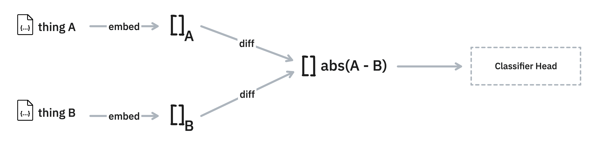

This document contains some tricks, hints and demos of applications that you might want to consider
in combination with this library. 

## Cache

Calculating embeddings can be expensive, even costly when you're using external providers. 
This is why this library offers an integration with [diskcache](https://grantjenks.com/docs/diskcache/). 
That way, you can infer the embeddings once and store them to disk for later.

Here's an example of how you might run that. 

```python
from embetter.text import SentenceEncoder
from embetter.utils import cached

encoder = cached("sentence-enc", SentenceEncoder('all-MiniLM-L6-v2'))

examples = [f"this is a pretty long text, which is more expensive {i}" for i in range(10_000)]

# This might be a bit slow ~17.2s on our machine
encoder.transform(examples)

# This should be quicker ~4.71s on our machine
encoder.transform(examples)
```

Note that you're also able to fetch the precalculated embeddings directly via: 

```python
from diskcache import Cache

# Make sure that you use the same name as in `cached`
cache = Cache("sentence-enc")
# Use a string as a key, if it's precalculated you'll get an array back.
cache["this is a pretty long text, which is more expensive 0"]
```

Be mindful of what does in to the encoder that you choose. It's preferable to give it
text as opposed to numpy arrays. Also note that the first time that you'll run this
it will take more time due to the overhead of writing into the cache.

## Difference Models 

Embeddings can be very useful when you're dealing with a deduplication use-case. The thinking
is that items that are close in embedded space might be great candidates to double-check. 

To help investigate this, this library offers a `DifferenceModel` utility. 



Here's how you might use it. 

```python
from embetter.model import DifferenceClassifier
from embetter.text import SentenceEncoder

mod = DifferenceClassifier(enc=SentenceEncoder())

# Suppose this is input data
texts1 = ["hello", "firehydrant", "greetings"]
texts2 = ["no",    "yes",         "greeting"]

# You will need to have some definition of "similar"
similar = [0, 0, 1]

# Train a model to detect similarity
mod.fit(X1=texts1, X2=texts2, y=similar)
mod.predict(X1=texts1, X2=texts2)
mod.predict_proba(X1=texts1, X2=texts2)

# The classifier head is a scikit-learn model, which you could save
# seperately if you like. The model can be accessed via: 
mod.clf_head
```

The model really is just a light wrapper, but it might make it easier to bootstrap.

## Speedup with Modal 

Embedding text can be slow, especially when you're running on a CPU. If you wish 
to speed up your embedding calculations you may enjoy using [modal](https://modal.com/). 
Modal allows you to add a GPU to a Python function simply by adding a decorator.

Not every encoder in embetter will get a speedup by using a GPU. But we've done some 
benchmarks and noticed that
`SentenceEncoder` as well as `ClipEncoder` should both benefit. These components will
also automatically detect when the GPU is available automatically.

The code below gives an example. 

```python
import time
import h5py
import modal


stub = modal.Stub("example-get-started")
image = (modal.Image.debian_slim()
         .pip_install("simsity", "embetter[text]", "h5py")
         .run_commands("python -c 'from embetter.text import SentenceEncoder; SentenceEncoder()'"))


# This is the function that actually runs the embedding, 
# notice that there's a GPU attached.
@stub.function(image=image, gpu="any")
def create(data):
    from embetter.text import SentenceEncoder
    return SentenceEncoder().transform(data)


@stub.local_entrypoint()
def main():
    tic = time.time()

    # You'd need to write your own function to read in the texts
    data = read_text()
    
    # This runs our decorated function on external hardware
    X = create.call(data)

    # Next we save it to disk for re-use
    with h5py.File('embeddings.h5', 'w') as hf:
        hf.create_dataset("embeddings",  data=X)
    toc = time.time()
    print(f"took {toc - tic}s to embed shape {X.shape}")
```

On our own benchmarks, we seem to get a 4-5x speedup with just a minor edit
to the code. This can be extremely helpful when you're trying to embed data
in bulk.
