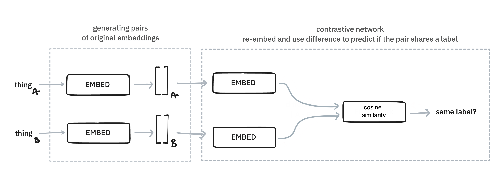
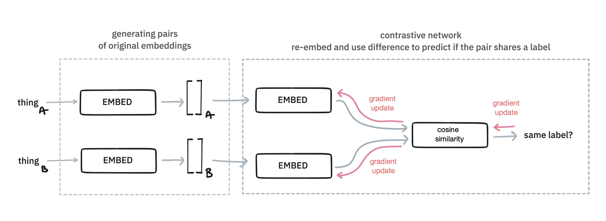
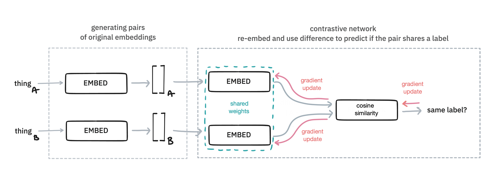
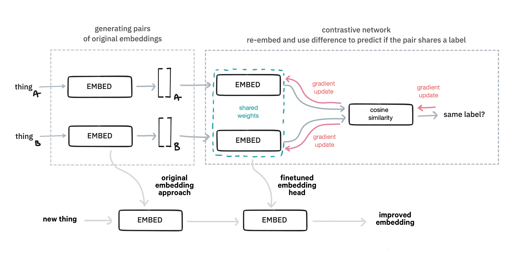

Embetter also supports tools to finetune the embedded space. This can be useful when you're trying to steer the embedding towards a task that you're interested in, which can make [bulk labelling](https://github.com/koaning/bulk/) much easier. This guide will give an example of this. 

## Feeding Forward

In general, this library is able to generate embeddings. 

<figure>
  
  <figcaption>Thing goes in. Vector goes out.</figcaption>
</figure>


But the embeddings could eventually be the input of a neural network. So let's draw that.

<figure>
  
  <figcaption>Thing goes in. Vector goes out. Then a feed forward network.</figcaption>
</figure>

In this diagram, the network has an input layer of size `n`, which is provide by one of our embedding models. Next it has a hidden layer of size `k` and an output node. To make the drawing easier we've only draw a single node as output, but the argument will also work for any number of classes. 

Let's now suppose that we train this model on a small set of labelled data. Then we'll have a gradient update that can update all the weights in this network.

<figure>
  
  <figcaption>The network has a gradient signal.</figcaption>
</figure>

Here's the main trick: after we're done training, we don't output the predictions from the neural network! Instead, we might the hidden layer as the new embedding. 

<figure>
  
  <figcaption>Notice how this layer "combines" the embedding and the label?</figcaption>
</figure>

The thinking here is that this embedding will blend the information from the embedding, which hopefully is general, with the label that we're interested in, which is specific to our problem. Having such a blended embedding can be very useful for bulk labelling purposes, but if we pick our hyperparams right, we might even have an embedding that's a better fit for modelling.

There are many methods that we might use for finetuning and we've just explained the method used in the `FeedForwardTuner` component. 

### Demo 

Let's demonstrate this effect with a demo. We will use the imdb dataset, hosted on Huggingface, for our example here. This dataset contains movie reviews and the task is to predict if these are negative or positive reviews. 

```python
from datasets import load_dataset
imdb = load_dataset("imdb")
```

Next we'll prepare our data. We'll assume that we have 200 annotated examples. Let's call this our "train" set. We will encode this data with a sentence encoder. 

```python
from embetter.text import SentenceEncoder

# Load up a sentence encoder.
enc = SentenceEncoder()

# Assume we have 200 labels 
n_train = 200

# Grab 200 examples and encode them
df_train = imdb['train'].to_pandas().sample(frac=1, random_state=32)
X_train = enc.transform(df_train['text'].to_list()[:n_train])
y_train = df_train['label'][:n_train].values
```

Next we will also prepare a seperate set which we'll use to evaluate. This set is much larger, but we'll still pluck a subset to make the compute time shorter. 

```python
# Let's grab 2000 examples for our "test" set 
n_test = 2000

# Grab 2000 examples and encode them
df_test = imdb['test'].to_pandas().sample(frac=1, random_state=42)
X_test = enc.transform(df_test['text'].to_list()[:n_test])
y_test = df_test['label'][:n_test].values
```

Next we'll load our finetuner. 

```python
from embetter.finetune import FeedForwardTuner 

# Create a network with some settings. You can totally change these. 
tuner = FeedForwardTuner(n_epochs=500, learning_rate=0.01, hidden_dim=200)

# Learn from our small training data
tuner.fit(X_train, y_train)
```

Given that we have a tuner trained, we can now apply it to our larger test set. 

```python
# Note that it's all skearn compatible 
X_test_tfm = tuner.transform(X_test)
```

### Evaluation 

We just created `X_test_tfm`, which is a finetuned variant of `X_test`. To help
explain how the embedded space changed we'll make a PCA chart for both. 

```python
from sklearn.decomposition import PCA
from matplotlib import pylab as plt 

X_orig = PCA().fit_transform(X_test)
X_finetuned = PCA().fit_transform(X_test_tfm)
```

Let's now show the difference.

```python
# First chart 
plt.scatter(X_orig[:, 0] , X_orig[:, 1], c=y_test, s=10)
plt.title("PCA of original embedding space")
```

<figure>
  
</figure>

Notice how the two classes (positive/negative) are all mixed up when we look at the PCA plot of the embeddings. Let's now see what happens when we apply finetuning.

```python
# Second chart
plt.scatter(X_finetuned[:, 0] , X_finetuned[:, 1], c=y_test, s=10)
plt.title("PCA of fine-tuned embedding space")
```

<figure>
  
</figure>

The classes seem to separate much better! That's good news if you'd like to make selections for bulk labelling. It should be much easier to select the class that you're interested in, or to select from a region where there is plenty of doubt.

### Hyperparams 

It deserves mentioning that the effect on the PCA-space does depend a lot on the chosen hyperparameters of the `ForwardFinertuner`. 

```python
tuner = ForwardFinetuner(n_epochs=500, learning_rate=0.01, hidden_dim=10)
```

If we decrease the hidden dimensions for example then we end up with a space that looks like this: 

<figure>
  
</figure>


You might want to play around with the settings, but it deserves to be said that you can also overfit on the few examples that you have in `X_train`.

### Extra Details 

In scikit-learn terms, a tuner is a "transformer"-component. That means that it can be used in a pipeline too! 

```python
from sklearn.pipeline import make_pipeline 

# Grab a few examples
X = df_test['text'].to_list()[:50]
y = df_test['label'].to_list()[:50]

# Let's build a pipeline!
pipe = make_pipeline(
    SentenceEncoder(),
    ForwardFinetuner(n_epochs=500, learning_rate=0.01, hidden_dim=10),
    PCA()
)

# The fine-tuning component can use `y_train`.
pipe.fit(X, y)

# Apply all the trained steps! 
pipe.transform(X)
```

Feel free to mix and match as you see fit. Also note that the tuner components in this library also support the `partial_fit` API incase you want to train on a stream of small batches.

## Contrastive Methods

There is more than one way to finetune though. Instead of using a feed forward architecture, you can also opt
for a contrastive approach. In this approach two items are compared with eachother. The idea here is that similarity on pairs can also be the based on which to finetune towards a goal.

<figure>
  
</figure>

This approach works by generating pairs of original embeddings. Some pairs will be positive, meaning they are embeddings of examples that belong to the same class. Others will be negatively sampled, meaning they don't share the same class. The embeddings get re-embedding with an extra embedding on top, which is determined by these pairs

<figure>
  
</figure>

Note that in general this extra embedding layer is the same for both the items. On other words: these embeddings share the same weights. 

<figure>
  
</figure>

When you're done training such a system, you can re-use this trained embedding head to map the original embedding to a new space. The thinking is that this will lead to a better embedding.

<figure>
  
</figure>

The benefit of this approach, compared to the feed forward one, is that you're flexible with how you generate pairs of examples. Are two examples part of the same label in a classification problem? Sure, that might be used. Doing something unsupervised and want two sentences from the same paragraph to be declared similar? Why not? Got image embeddings that you want to glue to text? You can really go nuts here, and this library will provide some tools to make it easy to bootstrap an approach using this technique.

### Demo 

As a demonstration of this technique, we'll use data found in the `datasets` folder of this repository.

```python
import srsly 
import itertools as it 
from pathlib import Path

examples = list(it.chain(srsly.read_jsonl(p) for p in Path("datasets")))
```

This `examples` list contains examples that look like this:

```json
{'text': 'Our code and dataset is available here.', 'cats': {'new-dataset': 1, 'dev-research': 0}}
```

The interesting thing in this dataset is that there are nested labels. For some examples we'll have all labels, but for others we may only have a subset.

```python
labels = set()
for ex in examples:
    for cat in ex['cats'].keys():
        if cat not in labels:
            labels = labels.union([cat])
assert labels == {'data-quality', 'dev-research', 'new-dataset'}
```

But from this we can generate pairs of examples that can be declared similar/dissimilar. 

```python
import random 

def sample_generator(examples, labels, n_neg=3):
    for label in labels:
        if label == "new-dataset":
            pos_examples = [ex for ex in examples if label in ex['cats'] and ex['cats'][label] == 1]
            neg_examples = [ex for ex in examples if label in ex['cats'] and ex['cats'][label] == 0]
            for ex in pos_examples:
                sample = random.choice(pos_examples)
                yield (ex['text'], sample['text'], 1.0)
                for n in range(n_neg):
                    sample = random.choice(neg_examples)
                    yield (ex['text'], sample['text'], 0.0)

learn_examples = list(sample_generator(examples, labels, n_neg=3))
texts1, texts2, similar = zip(*learn_examples)
```

Here's what the `texts1`, `text2` and `similar` lists might include as an example.

| Sentence A                              | Sentence B                                                                                                      | Similar |
|-----------------------------------------|-----------------------------------------------------------------------------------------------------------------|---------|
| Our code and dataset is available here. | We release the resulting corpus and our analysis pipeline for future research.                                  | 1       |
| Our code and dataset is available here. | In this paper, we introduce the predicted intent labels to calibrate answer labels in a self-training paradigm. | 0       |


It's these kinds of pairs that we can try to learn from. So let's do this with a `ContrastiveLearner` by finetuning the embeddings provided to us from a `SentenceEncoder`. To do that, we'll first need to generate the data in a format that it can used. 

```python
import numpy as np 
from embetter.text import SentenceEncoder
from embetter.finetune import ContrastiveLearner

# Generate numeric representations for the pairs
sentence_encoder = SentenceEncoder('all-MiniLM-L6-v2')
X1, X2 = sentence_encoder.transform(texts1), sentence_encoder.transform(texts2)

# This is a good habbit, numpy arrays are nicer to work with than tuples here
y = np.array(similar)
```

With the data ready, we can train. 

```python
from embetter.finetune import ContrastiveLearner

learner = ContrastiveLearner(epochs=50, batch_size=256, learning_rate=0.002, shape_out=384)
learner.fit(X1, X2, y)
```

Note that `learner` types of finetuners accept two data inputs in `.fit(X1, X2, y)`-method. This is not what the scikit-learn API would allow in a pipeline, but it is a format that allows you to be flexible. 

In this case the fine-tuning will be done quickly and we can generate new embeddings.

```python
texts = [ex['text'] for ex in examples if 'new-dataset' in ex['cats']]
labels = np.array([ex['cats']['new-dataset'] for ex in examples if 'new-dataset' in ex['cats']])

X_texts = sentence_encoder.transform(texts)
X_texts_tfm = learner.transform(X_texts)
```

For fun, we can also see if these new embeddings give us more predictive power. 

```python
from sklearn.linear_model import LogisticRegression

def calc_performance(X_in, y_in, name):
    mod = LogisticRegression(class_weight="balanced").fit(X_in, y_in)
    acc = np.mean(mod.predict(X_in) == y_in)
    print(f"{name} got {acc=}")

calc_performance(X_texts, labels, "original embeddings")
calc_performance(X_texts_tfm, labels, "finetuned embeddings")

# original embeddings got acc=0.8624434389140272
# finetuned embeddings got acc=0.9180995475113122
```

This isn't a proper benchmark, we're measuring the train set after all, but it does comfirm that the embeddings differ. If you're finetuning your own embeddings you should always think hard about how you'd like to evaluate this. 

### More learners

This library also provides a learning that directly integrates with `sentence-transformers`. Training these is typically slower, because it involves finetuning an entire BERT pipeline but may provide solid results. One downside of this approach is that you'll have a learner than cannot accept general arrays. It must provide inputs that sentence-transformers can deal with, which it typically text.

```python
from embetter.finetune import SbertLearner
from sentence_transformers import SentenceTransformer

# Load in a sentence transformer manually
sent_tfm = SentenceTransformer('all-MiniLM-L6-v2')

# Pass it to the SbertLearner and train
sbert_learn = SbertLearner(sent_tfm=sent_tfm)
sbert_learn.fit(texts1, texts2, labels)

# Once training is done, it can be used to encode embeddings
# Note that we input `texts`, not `X_texts`!
X_texts_sbert = sbert_learn.transform(texts)

# You can now save the new model which is stored in the original variable
# the `SbertLearner` object directly operates on it
sent_tfm.to_disk(...)
```

### `Tuner`s vs. `Leaner`s

One downside of the `learner` objects is that they cannot be used in a scikit-learn pipeline during the `.fit()`-step because they have an incompatible API. To mitigate these, each "`Learner`" has a "`Tuner`" that _can_ be used in a pipeline. Under the hood, a "tuner" will use a "learner" to make sure the finetuning works, but it won't be as flexible when it comes to training. 

```python
from embetter.finetune import SbertTuner, ContrastiveTuner
from embetter.text import SentenceEncoder
from sklearn.pipeline import make_pipeline

# Notice that we're using `tuner` here, not `learner`!
pipe = make_pipeline(SentenceEncoder(), Contrastivetuner())
pipe.fit(X, y).predict(X)
```

### Performance

This library favors ease of use over optimal performance, but it's certainly possible that the performance can be improved. If you have a clever suggestion, feel free to discuss it by opening [an issue](https://github.com/koaning/embetter/issues).
